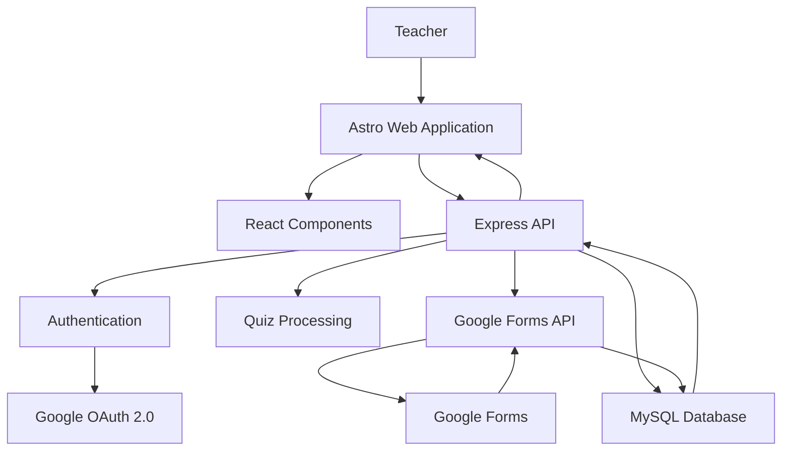

# SAEA

### Sistema de Análisis Educativo y Autoevaluación

<p align="center">

[](https://astro.build/)
[](https://react.dev/)
[](https://www.typescriptlang.org/)
[](https://nodejs.org/)
[](https://expressjs.com/)
[](https://www.mysql.com/)
[](https://www.docker.com/)
[](https://www.google.com/forms/about/)

</p>

<p align="center">
  <strong>Educational assessment creation, distribution, and analytics in one platform.</strong>
</p>

---

## Overview

SAEA provides an end-to-end workflow for educational assessment:

**Create → Save → Generate → Distribute → Collect → Analyze**

Teachers can create structured quizzes, define their specifications and questions, save them as drafts, generate a corresponding Google Quiz, and later retrieve and analyze the results submitted by students.

The platform uses Google authentication to identify teachers and securely associate their quizzes and results with their account.

---

## Features

### Quiz creation

Create assessments using a structured quiz editor that includes:

* Quiz title and subject
* Total number of questions
* Thematic areas
* Content
* Learning objectives
* Number of classes
* Skills and skill distribution
* Multiple-choice questions
* Answer alternatives
* Correct answer selection

The quiz editor includes validation logic to ensure that the number of questions matches the requirements defined in the specification table.

### Draft management

Quizzes can be saved before being published.

Teachers can:

* Create new quizzes
* Save quizzes as drafts
* Update existing drafts
* Browse saved quizzes
* Search through quizzes
* Distinguish between drafts and performed assessments

### Google Forms integration

SAEA can automatically transform a quiz into a Google Form configured as a Google Quiz.

The generated form includes:

* Quiz questions
* Answer alternatives
* Correct answers
* Automatic grading
* Required questions
* Verified email collection

The resulting Google Form URL and ID are stored in the database for later access.

### Student results

After students complete a generated Google Quiz, SAEA can retrieve their responses through the Google Forms API and persist the results in the application's database.

The system stores information such as:

* Student email
* Submission date
* Question position
* Selected answer
* Correct answer
* Whether the answer was correct

### Statistical analysis

Performed quizzes provide an analysis dashboard with information such as:

* Average grade
* Median
* Mode
* Highest grade
* Lowest grade
* Pass rate
* Fail rate
* Student results
* Question-level performance
* Grade distribution charts

The dashboard is intended to provide educators with a consolidated view of assessment performance.

### Google authentication

Teachers authenticate using their Google account.

SAEA uses Google OAuth 2.0 to obtain the permissions required to work with Google Forms on behalf of the authenticated user.

Session authentication is handled using JWT-based cookies.

---

## Architecture

SAEA is divided into a frontend application, a backend API, and a relational database.



### Frontend

The frontend is built with:

* Astro
* React
* TypeScript
* Bootstrap
* Sass
* Chart.js
* Nanostores

Astro provides the application's page structure and server-rendered architecture, while React is used for interactive components such as the quiz editor, specification table, question management, and dynamic interfaces.

### Backend

The backend is implemented using:

* Node.js
* Express
* TypeScript
* JWT
* Google APIs
* MySQL2

The API exposes endpoints for quiz management, authentication, quiz generation, and result retrieval.

### Database

SAEA uses MySQL 8 as its primary relational database.

The database contains entities for:

* Teachers
* Subjects
* Quizzes
* Questions
* Answers
* Quiz-question relationships
* Specifications tables
* Skills
* Performed quizzes
* Students
* Student responses
* Response results

Database initialization, functions, procedures, and views are maintained under:

```text
server/database/MySQL/
```

---

## Project Structure

```text
SAEA/
│
├── public/
│   ├── fonts/
│   └── images/
│
├── server/
│   ├── database/
│   │   └── MySQL/
│   │       ├── debug/
│   │       ├── init/
│   │       └── querys/
│   │
│   ├── handlers/
│   │   ├── generate_google_form.ts
│   │   ├── get_quiz.ts
│   │   ├── update_quiz_results.ts
│   │   ├── verify_session_token.ts
│   │   └── ...
│   │
│   ├── request/
│   │   ├── oauth2.ts
│   │   ├── process_quiz.ts
│   │   ├── quiz_results.ts
│   │   ├── router.ts
│   │   └── ...
│   │
│   ├── server.ts
│   └── tsconfig.json
│
├── src/
│   ├── assets/
│   ├── components/
│   ├── content/
│   ├── handlers/
│   ├── layouts/
│   ├── pages/
│   │   ├── quiz/
│   │   ├── login.astro
│   │   └── ...
│   ├── styles/
│   └── ...
│
├── util/
│
├── astro.config.mjs
├── docker-compose.yml
├── package.json
├── tsconfig.json
└── README.md
```

---

## Application Flow

### 1. Authentication

The teacher signs in using Google.

```text
Google Account
      │
      ▼
Google OAuth 2.0
      │
      ▼
SAEA Backend
      │
      ▼
Teacher stored in MySQL
      │
      ▼
JWT session cookie
```

### 2. Quiz creation

```text
Teacher
   │
   ▼
Quiz Editor
   │
   ├── Quiz metadata
   ├── Specification table
   └── Questions & answers
   │
   ▼
Save Quiz
   │
   ▼
MySQL
```

### 3. Google Quiz generation

```text
Saved Draft
    │
    ▼
SAEA Backend
    │
    ▼
Google Forms API
    │
    ▼
Google Quiz
    │
    ▼
Form URL + Form ID stored in MySQL
```

### 4. Results processing

```text
Students
   │
   ▼
Google Quiz
   │
   ▼
Google Forms Responses API
   │
   ▼
SAEA Backend
   │
   ▼
MySQL
   │
   ▼
Analytics Dashboard
```

---

## API Routes

The backend exposes the following main route groups:

| Route                         | Purpose                                      |
| ----------------------------- | -------------------------------------------- |
| `/request/oauth2`             | Google authentication and session management |
| `/request/quiz`               | Create, update, and generate quizzes         |
| `/request/get/quiz/all`       | Retrieve available quizzes                   |
| `/request/get/quiz/draft`     | Retrieve quiz drafts                         |
| `/request/get/quiz/performed` | Retrieve generated/performed quizzes         |
| `/request/quiz/results`       | Retrieve and update student results          |

The quiz workflow includes endpoints for saving quizzes, updating drafts, generating Google Forms, and synchronizing assessment results.

---

## Tech Stack

### Frontend

| Technology | Purpose                     |
| ---------- | --------------------------- |
| Astro      | Web application framework   |
| React      | Interactive UI components   |
| TypeScript | Static typing               |
| Bootstrap  | UI utilities and components |
| Sass       | Styling                     |
| Chart.js   | Data visualization          |
| Nanostores | Shared client-side state    |

### Backend

| Technology  | Purpose                          |
| ----------- | -------------------------------- |
| Node.js     | Runtime                          |
| Express     | HTTP API                         |
| TypeScript  | Backend development              |
| JWT         | Session authentication           |
| Google APIs | Google integration               |
| OAuth 2.0   | Authentication and authorization |

### Database & Infrastructure

| Technology     | Purpose                      |
| -------------- | ---------------------------- |
| MySQL 8        | Relational database          |
| mysql2         | MySQL driver                 |
| Docker Compose | Local database environment   |
| Nodemon        | Development server reloading |

---

## Requirements

Before running SAEA locally, make sure you have:

* Node.js
* npm
* Docker and Docker Compose
* A MySQL-compatible environment
* A Google Cloud project with OAuth 2.0 credentials
* Access to the Google Forms API

---

## Installation

Clone the repository and install the dependencies:

```bash
npm install
```

Create a `.env` file in the project root.

Example:

```env
DB_HOST=localhost
DB_USER=your_database_user
DB_PORT=3306
DB_PASSWORD=your_database_password
DB_NAME=SAEA

JWT_SECRET=your_jwt_secret

OAUTH_CLIENT_ID=your_google_client_id
OAUTH_CLIENT_SECRET=your_google_client_secret
OAUTH_REDIRECT_URIS=your_google_redirect_uri

NODE_ENV=development
```

> Never commit real credentials, refresh tokens, database passwords, or OAuth secrets to version control.

---

## Database Setup

The project includes a Docker Compose configuration for MySQL 8.

Start the database with:

```bash
docker compose up -d
```

The database initialization scripts located under:

```text
server/database/MySQL/init/
```

are mounted into MySQL's initialization directory and can be used to create the application's database structure.

The project includes SQL definitions for:

* Tables
* Functions
* Stored procedures
* Views
* Quiz processing logic
* Result processing logic

Check the environment variables before starting the application to ensure that the backend points to the correct database instance.

---

## Running the Application

SAEA uses separate development processes for the Astro application and the Express backend.

### Start the frontend

```bash
npm run dev
```

The Astro development server runs on:

```text
http://localhost:4321
```

### Start the backend

In another terminal:

```bash
npm run server
```

The Express API runs on:

```text
http://localhost:8080
```

During development, Astro proxies requests beginning with `/request` to the backend server.

---

## Available NPM Scripts

| Command                | Description                                     |
| ---------------------- | ----------------------------------------------- |
| `npm run dev`          | Start the Astro development server              |
| `npm run build`        | Type-check and build the Astro application      |
| `npm run preview`      | Preview the production build                    |
| `npm run server`       | Start the Express backend with automatic reload |
| `npm run server:check` | Type-check the backend                          |
| `npm run watcher`      | Rebuild the project when source files change    |
| `npm run test`         | Run the project's test content script           |

---

## Security

SAEA currently uses several mechanisms to protect authenticated operations:

* Google OAuth 2.0 for user authentication
* JWT-based session tokens
* HTTP-only session cookies
* Session validation middleware
* Protected backend routes
* Database-backed teacher identities
* Environment variables for secrets and credentials

The backend validates the session token before allowing protected quiz and result operations.

---

## Development Notes

The project is currently structured as a modular monorepo-style application within a single repository:

* `src/` contains the Astro frontend and client-side logic.
* `server/` contains the Express API and database integration.
* `server/database/MySQL/init/` contains the database initialization logic.
* `server/handlers/` contains reusable backend operations.
* `server/request/` contains the API route implementations.
* `src/components/` contains reusable UI components.
* `src/pages/` defines application routes.

The project also contains debugging and testing SQL scripts under:

```text
server/database/MySQL/debug/
```

---

## Current Scope

SAEA is focused on educational assessment workflows, particularly:

* Quiz construction
* Assessment specification
* Google Quiz generation
* Student response collection
* Result persistence
* Academic performance analysis
* Teacher-oriented dashboards

The current implementation is centered around multiple-choice assessments and Google Forms integration.

---

## Project Status

**Version:** `0.0.1`

SAEA is an actively developed project. Some areas of the application may still contain experimental, testing, or legacy code, particularly within the database and development tooling.

---

## License

No license is currently specified in the project repository.

If this project is intended for public distribution, add an appropriate `LICENSE` file and update this section accordingly.

---

## Acknowledgements

SAEA is built on top of several open-source technologies and Google APIs, including:

* [Astro](https://astro.build/)
* [React](https://react.dev/)
* [Express](https://expressjs.com/)
* [MySQL](https://www.mysql.com/)
* [Google Forms API](https://developers.google.com/forms/api)
* [Google OAuth 2.0](https://developers.google.com/identity/protocols/oauth2)
* [Chart.js](https://www.chartjs.org/)
* [Bootstrap](https://getbootstrap.com/)

---

## SAEA

**Sistema de Análisis Educativo y Autoevaluación**

A platform for creating assessments, integrating them with Google Forms, and turning student responses into useful educational insights.
